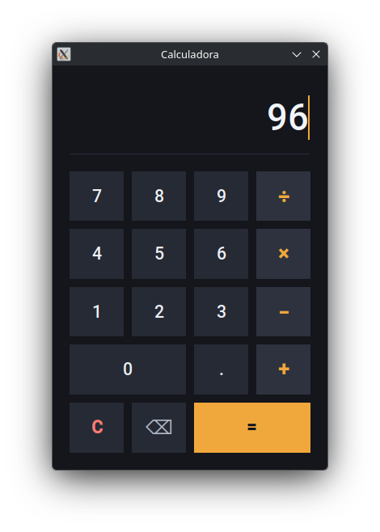

# Calculadora em Python (Tkinter)

Calculadora de desktop em **Python** com interface gráfica em **Tkinter**, sem nenhuma dependência
externa para rodar.
Projeto com foco em aprendizado de GUI, organização de código e versionamento com Git/GitHub.



---

## Funcionalidades

- Interface gráfica com tema escuro, botões sem moldura e realce sob o cursor
- Operações básicas:
  - Soma (+)
  - Subtração (−)
  - Multiplicação (×)
  - Divisão (÷)
- Encadeamento: depois do `=`, apertar um operador continua a conta a partir do resultado
- Botão **⌫** apaga só o último caractere; **C** zera o visor inteiro
- **Enter** calcula (inclusive o do teclado numérico), e digitar no teclado se comporta igual a clicar
- O visor aceita digitação e colagem, mas **só de caractere aritmético** — letra não entra
- Tratamento de erros: expressão inválida mostra `Erro` no visor, a janela nunca quebra

---

## Como o código está organizado

Duas camadas, separadas justamente para a regra ficar testável:

```
├── src/
│   ├── expressao.py    # a regra: avaliar() e deve_reiniciar() — lógica pura, sem Tkinter
│   └── calculadora.py  # a interface: widgets e mainloop
└── tests/
    └── test_expressao.py
```

`calculadora.py` cria a janela em nível de módulo, então importá-lo abre a UI e bloqueia no
`mainloop()` — por isso toda regra de negócio mora em `expressao.py`, que os testes importam sozinho.

**A expressão não é avaliada com `eval`.** O visor é um campo de texto editável: dá para digitar e
colar nele. Com `eval`, qualquer texto colado ali seria executado como Python. São duas camadas:

1. **Filtro de digitação** — o campo só aceita `0-9 . + - * / ( )`. Letra digitada ou colada é
   recusada na hora, não chega a aparecer no visor.
2. **Allowlist do avaliador** — a expressão é lida com `ast.parse` e percorrida nó a nó: só número,
   as quatro operações e sinal unário. Qualquer outra coisa vira `Erro`, sem executar nada.

---

## Tecnologias utilizadas

- Python 3
- Tkinter (biblioteca padrão do Python)
- pytest (só para desenvolver)
- Git & GitHub

---

## Requisitos

- Python 3.10+
- Tk instalado no sistema — o `tkinter` é da biblioteca padrão, mas depende da
  lib Tk do SO. No Windows e no macOS ela já vem com o instalador do Python.
  No Linux é um pacote à parte:

  ```bash
  sudo pacman -S tk             # Arch / CachyOS
  sudo apt install python3-tk   # Debian / Ubuntu
  sudo dnf install python3-tkinter  # Fedora
  ```

Não há dependências externas, então não é preciso criar um ambiente virtual para rodar.

## Como usar

```bash
python src/calculadora.py
```

## Testes

A suíte cobre a lógica de cálculo (`src/expressao.py`); ela não abre janela.

```bash
pip install -r requirements-dev.txt
pytest
```
